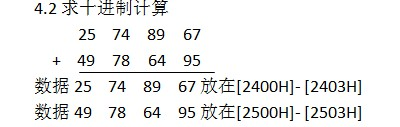

>  1.1将1000H-1063H中的各字节内容清0（或置FFH）
```
	MOV SI, 1000H;
	MOV CX, 0064H;
	MOV AL, 00H;
LABEL:
	MOV [SI], AL;
	INC SI;
	DEC CX;
	JNZ LABEL;
```

> 1.2将1000H-1063H中的字节内容传递到4000H-4063H
```
	MOV SI, 1000H;
	MOV DI, 4000H;
	MOV CX, 0064H;
LABEL:
	MOV AL, [SI];
	MOV [DI], SI;
	INC SI;
	INC DI;
	DEC CX;
	JNZ LABEL;
```

> 2.找最大值最小值
从2500H-2563H中存放着数据，把其中的最大值找出来，地址存放在3000H中
```
	MOV SI, 2500H;
	MOV CX, 0064H;
	MOV AL, 00H;
LABEL1:
	CMP AL, [SI];
	JA LABEL2;
	MOV AL, [SI];
LABEL2:
	INC SI;
	DEC CX;
	JNZ LABEL1;
	MOV [3000], AL;
```

> 3.从2100H 开始存放100个无符号数，统计有多少个正数，多少个负数。负数个数存入2200H
```
	MOV SI, 2100H;
	MOV CX, 100;
	MOV BL, 00H;
LABEL1:
	MOV AL, [SI];
	CMP AL, 00H;
	JG LABEL2;
	INC BL;
LABEL2:
	INC SI;
	DEC CX;
	JNZ LABEL1;
	MOV [2200], BL;

```

> 4.1求 1AH+02H+31H+14H+2FH+06H=???
数据1AH、02H、31H、14H、2FH、06H
放在[3000H]- [3005H]处,结果放AL
```
	MOV SI, 3000H;
	MOV CX, 0006H;
	MOV AL, 00H;
LABEL:
	ADD AL, [SI];
	INC SI;
	DEC CX;
	JNZ LABEL;
```

> 
```
	MOV SI, 2400H;
	MOV DI, 2500H;
	MOV CX, 0004H;
	MOV AL, 00H;
LABEL:
	MOV AL, [SI];
	ADC AL, [DI];
	DAA;
	MOV [BP], AL;
	MOV AL, 00H;
	INC BP;
	INC SI;
	INC DI;
	DEC CX;
	JNZ LABEL;
```

> 5.1字节型变量VAR1、VAR2和VAR3存放有3个无符号数，将其中的内容按从大到小重新排列。
```
	MOV AL, VAR1;
	CMP AL, VAR2;
	JB LABEL1;	如果VAR1 < VAR2 跳转交换
	CMP AL, VAR3;
	JB LABEL2;	如果VAR1 < VAR3 跳转交换
	MOV AL, VAR2;
	CMP AL, VAR3;
	JB LABEL3;	如果VAR2 < VAR3 跳转交换
	HLT;
LABEL1:
	XCHG VAR2, AL;
	MOV VAR1, AL;
	CMP AL, VAR3;
	JB LABEL2;	如果VAR1 < VAR3跳转交换
	MOV AL, VAR2;
	CMP AL, VAR3;
	JB LABEL3;	如果VAR2 < VAR3 跳转交换
	HLT
LABEL2:
	XCHG VAR3, AL;
	MOV VAR1, AL;
	MOV AL, VAR2;
	CMP AL, VAR3;
	JB LABEL3;	如果VAR2 < VAR3 跳转交换
	HLT
LABEL3:
	XCHG VAR3, AL;
	MOV VAR2, AL;
	HLT
```

> 5.2存放在2040H-2045H中的字节数据由大到小排列

```
	MOV SI, 2040;
	MOV CX, 06H;
	MOV BL, 00H;
	MOV AL, [SI];
LABEL1:	;	外层循环
LABEL2:	;	内层循环
	MOV BL, CX;
	CMP AL, [SI+BL];
	JB LABEL3;	判断
	XCHG AL, [SI+BL];
lABEL3:	;
	DEC BL;
	JNZ LABEL2;
	DEC CX;
	JNZ LABEL1;
```